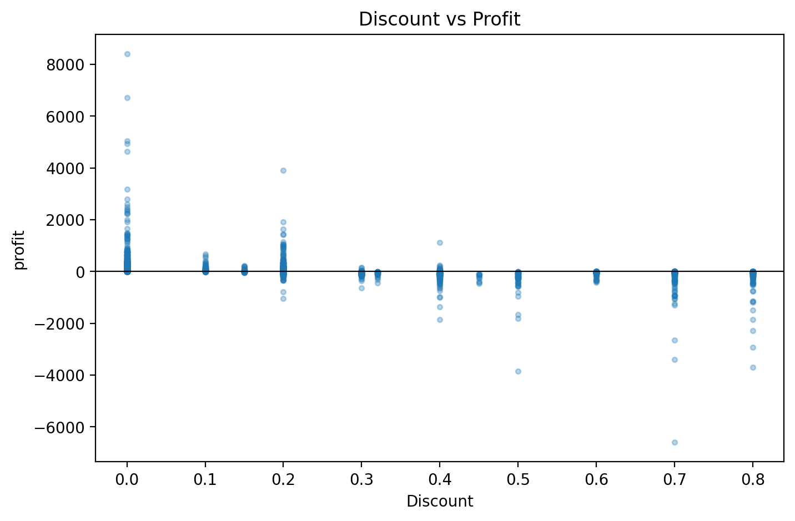
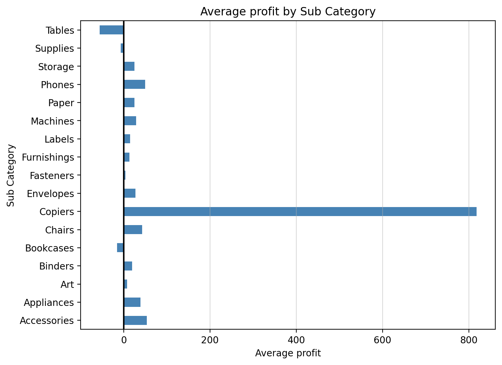
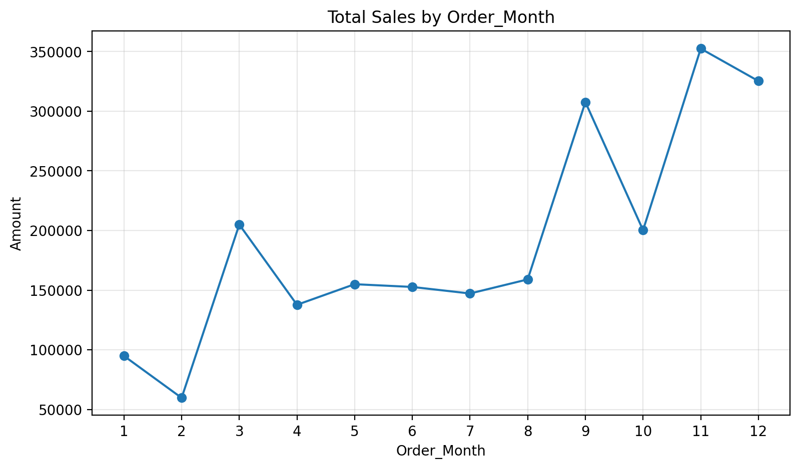

# 📊 Superstore Sales & Profitability Analysis

An end-to-end data analytics project analyzing sales performance, profitability, and customer behavior for a retail superstore, using Python. The project covers data cleaning, exploratory data analysis, and business insight generation, culminating in actionable recommendations to improve profitability.

## 🎯 Business Problem

A retail superstore wants to understand which products, regions, and customers drive profitability — and where discounting practices may be eroding margins — in order to make informed decisions on pricing, inventory, and customer retention strategy.

## 🛠️ Tools & Libraries

- Python
- Pandas
- NumPy
- Matplotlib
- Jupyter Notebook

## 📁 Project Structure

superstore-sales-analysis/
│
├── README.md
├── requirements.txt
├── .gitignore
│
├── data/
│   └── raw/
│       └── superstore.csv
│
├── notebooks/
│   └── superstore_analysis.ipynb
│
└── Visualization/

## 🔍 Analysis Overview

1. **Data Cleaning** — handled data type conversions, standardized column names, checked for duplicates
2. **Feature Engineering** — extracted year/month from order dates, calculated profit margin
3. **Exploratory Data Analysis** — sales and profit by category, sub-category, and region; discount vs. profit relationship; monthly/yearly sales trends; top customer analysis
4. **Business Insights & Recommendations** — translated findings into concrete, data-backed action items

## 💡 Key Insights

- Orders with discounts above 30% are overwhelmingly unprofitable, with losses intensifying sharply beyond 50%
- Furniture is the weakest-performing category (~2.5% margin vs. ~17% for Technology/Office Supplies), driven by heavy discounting in Tables and Bookcases
- Central region has the weakest profit margin (7.9%) despite solid revenue, linked to a disproportionately high average discount rate (24%)
- Technology is the strongest-performing category, generating both the highest sales ($836K) and profit ($145K)
- Sales grew ~51% from 2015 to 2017, with strong seasonality peaking in September, November, and December
- The top 10 customers (1.3% of the customer base) generate 6.7% of total revenue

## ✅ Recommendations

1. Cap discounts at 20–30% for Furniture, particularly Tables and Bookcases
2. Reduce Central region's average discount toward the 10–15% range used by higher-performing regions
3. Increase inventory and marketing investment ahead of peak season (Sept, Nov, Dec)
4. Expand marketing focus on Copiers and the broader Technology category
5. Introduce a loyalty/VIP program for top revenue-generating customers

## 📈 Sample Visualizations

### Discount vs. Profit Relationship

### Average Profit by Sub-Category

### Monthly Sales Trend

*(Add 2-3 of your best charts here as images — see instructions below)*

## 🚀 How to Run

1. Clone this repository
2. Install dependencies: `pip install -r requirements.txt`
3. Open `notebooks/superstore_analysis.ipynb` in Jupyter Notebook
4. Run all cells

## 📌 Dataset

[Sample Superstore Dataset](https://www.kaggle.com/datasets) — retail transaction data including sales, profit, discount, category, region, and customer information.
